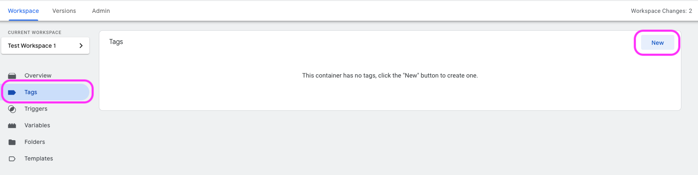
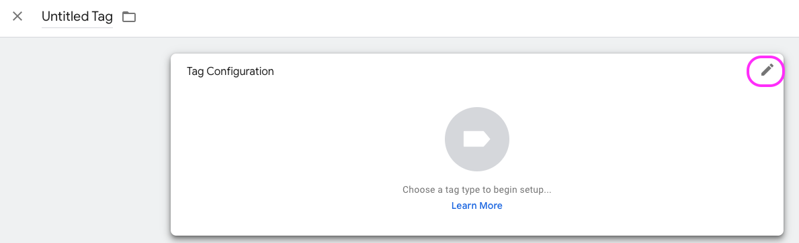
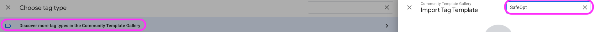
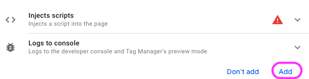
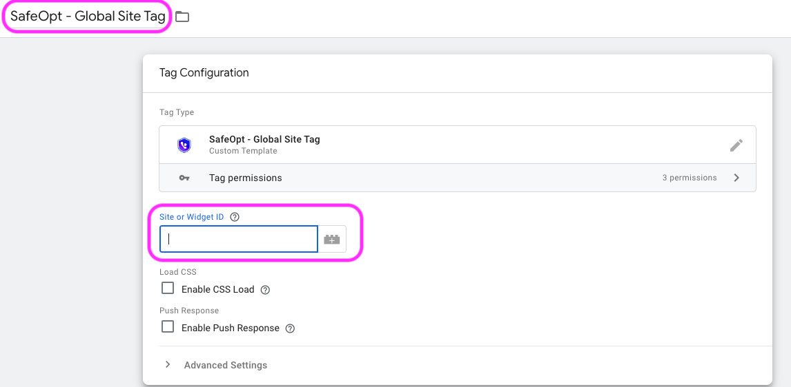
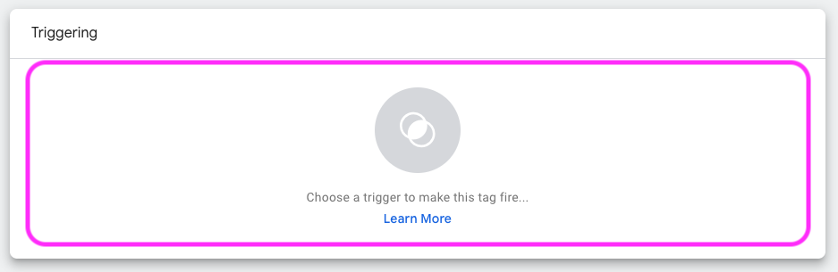
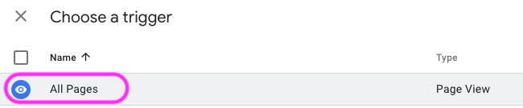

# google-tag-manager-global-site-tag
Google Tag Manager Template for SafeOpt Global Site Tag 

**NOTE: This is only 1 of 2 templates that must be used to correctly configure SafeOpt tags on your site**

**Must Also Install and Configure SafeOpt - Conversion Tag**

<!-- add SafeOpt Conversion Tag Repo Link -->

### Information
- Template name: SafeOpt - Global Site Tag
- Brand: [SafeOpt](https://www.safeopt.com/)
- Works with: Google Tag Manager (must be setup to work with your site)
- Install method: 
    - Google Tag Manager Community Template Gallery 
    - Import template into Google Tag Manager
- Version: 1.0.0
- Developer: [Addshoppers](https://www.addshoppers.com/) 
- Contact: [help@addshoppers.com](mailto:help@addshoppers.com)

---

### Description
This is a Google Tag Manager that installs the SafeOpt Global Site Tag your site.  You must have Google Tag Manager correctly configured for the SafeOpt tags to work on your site. 

**NOTE: Please contact [help@addshoppers.com](mailto:help@addshoppers.com) if you need support.**

---

### Install Steps

1. Click on Tags on the right menu bar in your Google Tag Manger (GTM) account 

2. Click the New button

3. click on the tag to configure

4. Click on Discover more tag types in Community Template Gallery

5. Click on search and look for SafeOpt

6. Select SafeOpt - Global Site Tag template from community gallery

7. Click on Add to Workspace

8. Click Add

9. Name Tag `SafeOpt - Global Site Tag`

10. Enter Site ID -- **Contact [help@addshoppers.com](mailto:help@addshoppers.com) for site id**

9. Click anywhere in the Trigger box to configure trigger

10. Click All Pages (this will add the global site tag to all pages on your site)

11. Click the save button

12. Submit and Publish Changes

13. Verify tag is installed correctly by visiting your site and typing `AddShoppersWidget` in console and looking for the site_id

### GitHub Repo Notes

Templates are created and updated in Addshoppers GTM account.  

When a new version is release please do the following:
1. export updated template from GTM
2. Replace the current `template.tpl` file with updated file (must use this name)
3. update readme.md with the latests version and any other updates required
4. update `metadata.yaml` with the latest version and SHA value

More Info at: [GTM Repo Requirement](https://developers.google.com/tag-platform/tag-manager/templates/gallery)
